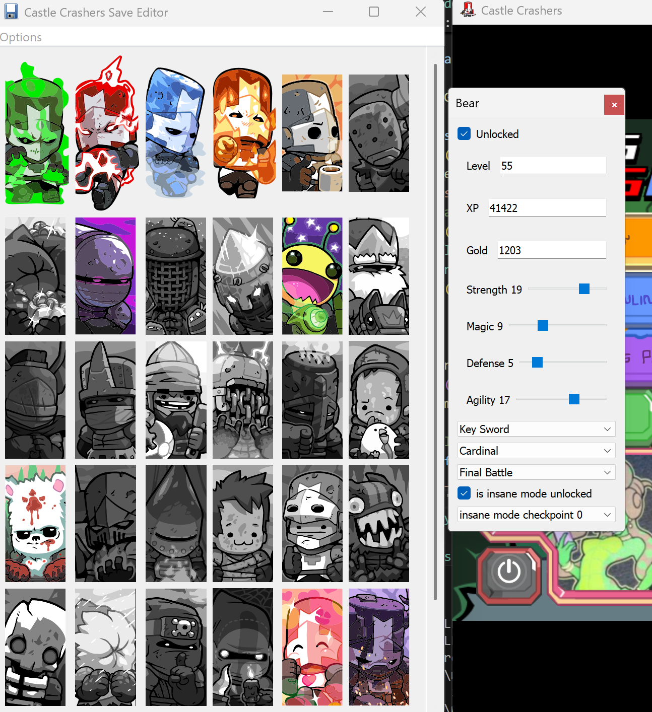

# Castle Crashers Save Editor

To use the save editor first open castle crashers to the title screen. Then start the save editor. To edit a character, click on their image while still in the title screen. To save all changes to disk, load any character and exit to map.



Note: the program cannot unlock DLC characters

## Installation

Download the exe from the releases page

## Editing and Building

The program was developed with Python 3.10.18. It may work with later versions, but compatibility has not been tested.

Creating a conda environment (Optional):
```bash
conda create -n ccsave python=3.10.18
conda activate ccsave
```
Downloading dependencies:
```bash
pip install -r requirements.txt
```
Running the program:
```bash
python Main.py
```
Bundling the program to an exe with pyinstaller:
```bash
.\build.bat
```